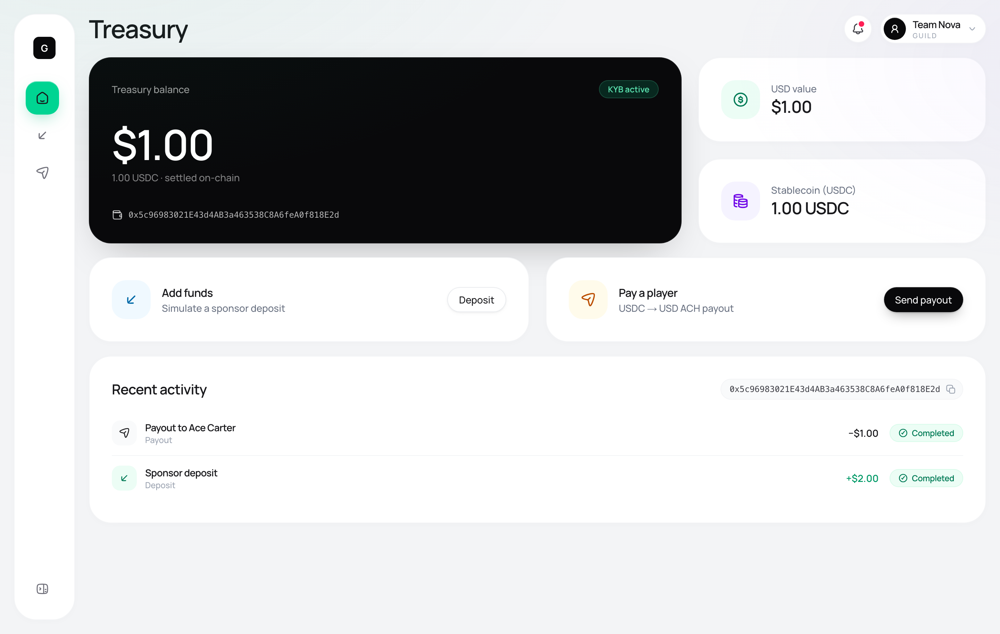
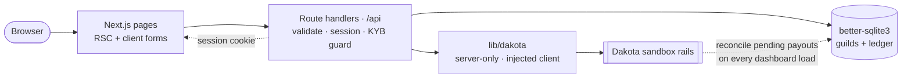
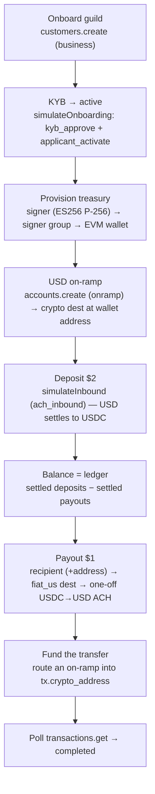
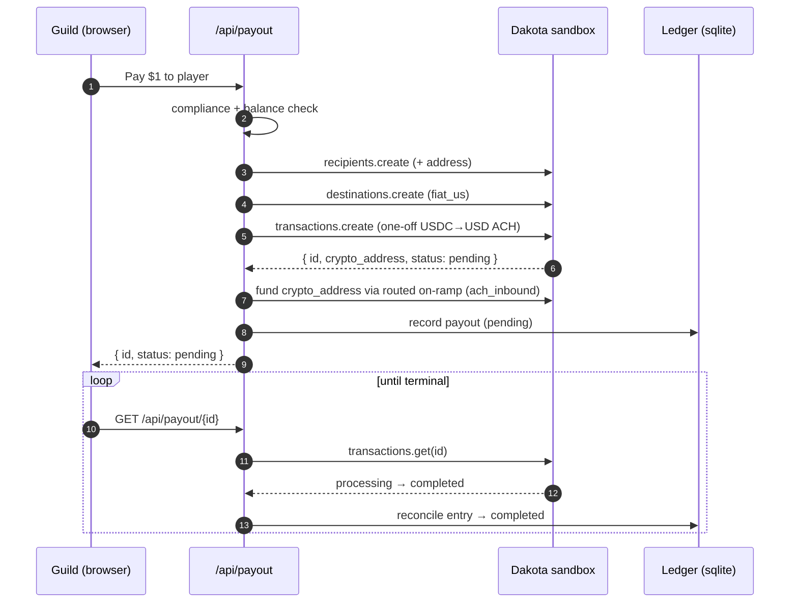

<div align="center">



&nbsp;


### A KYB-gated neobank for gaming & esports guilds — on Dakota's real sandbox rails.

A guild completes **KYB**, receives sponsor and prize money into a **treasury**, holds **USD + USDC**, and pays out winnings to **players** — and every money movement settles on **actual Dakota rails**, not a mock. The guild is a Dakota **business customer**; players are **payout recipients**. The polished product flow and the contest verification bar are the *same flow*.

**[ Features ↗ ](#what-it-does)** &nbsp;·&nbsp; **[ Architecture ↗ ](#architecture)** &nbsp;·&nbsp; **[ The money flow ↗ ](#the-money-flow-the-verified-recipe)** &nbsp;·&nbsp; **[ Run it locally ↗ ](#run-it-locally)**

</div>

---

## Table of contents

- [What Guildpay is](#what-guildpay-is)
- [What it does](#what-it-does)
- [Architecture](#architecture)
- [The money flow (the verified recipe)](#the-money-flow-the-verified-recipe)
- [The payout lifecycle](#the-payout-lifecycle)
- [Balance is a ledger, on purpose](#balance-is-a-ledger-on-purpose)
- [What's real — the honesty table](#whats-real--the-honesty-table)
- [Engineering decisions & the hard problems](#engineering-decisions--the-hard-problems)
- [The app](#the-app)
- [Tech stack](#tech-stack)
- [Project layout](#project-layout)
- [Run it locally](#run-it-locally)
- [Deploying](#deploying)
- [Tests](#tests)

---

## What Guildpay is

Esports guilds move real money — sponsor deposits in, prize splits and player salaries out — but they're stuck gluing together spreadsheets and personal bank transfers. Guildpay is the neobank for that: a guild passes **KYB** once, funds a **treasury**, and pays players from it, with compliance and provenance built in.

The design rule is **gate before you move money**. A guild cannot log in, view a balance, deposit, or pay anyone until its `kyb_status` is `active` — enforced server-side on every route, not as a UI hint. Nothing in the product touches Dakota until KYB clears, which is exactly what the sandbox rails require anyway: *nothing — no wallet, on-ramp, recipient, or transaction — works until the customer is active.*

## What it does

Five flows, each mapped one-to-one onto a real Dakota capability:

| Capability | Guildpay action | Dakota calls |
|---|---|---|
| **KYB-gated onboarding** | Guild submits business details; KYB is driven to `active` | `customers.create` → `sandbox.simulateOnboarding` (`kyb_approve`, `applicant_activate`) → poll `customers.get` |
| **KYB-gated login** | Sign-in is rejected until KYB is `active` | our `requireActiveGuild` session guard |
| **Deposit** | Sponsor/prize funds land in the treasury | `accounts.create` (USD ACH on-ramp) → `sandbox.simulateInbound` (`ach_inbound`) — USD settles to USDC |
| **Balance (USD + USDC)** | Treasury overview + activity feed | ledger-derived (see [below](#balance-is-a-ledger-on-purpose)) |
| **Outbound transfer → `completed`** | Pay a player their winnings | `recipients.create` → `destinations.create` (`fiat_us`) → `transactions.create` (one-off) → `transactions.get` |

Plus an in-line **compliance gate** on payouts (flag over $1,000, block over $10,000) and automatic **payout reconciliation** so the activity feed never lies about a payout's status.

## Architecture

All Dakota calls happen **server-side** behind a thin, dependency-injected `lib/dakota/*` layer — the API key never reaches the browser, and every integration function takes the client as its first argument so it's unit-testable with a fake. Route handlers validate input, enforce the session + KYB guard, and delegate. Money truth lives in Dakota; a local **ledger** mirrors it for display.



The boundaries are a few typed contracts, and the rest composes:

| Contract | Role |
|---|---|
| `Guild` | Login (`email`, `passwordHash`) ↔ Dakota `customerId`, cached `walletId` / `walletAddress` / `usdAccountId`, and `kybStatus`. |
| `LedgerEntry` | A `deposit` or `payout` backed by a real Dakota transaction: `amount`, `status`, `txId`. Balance = settled deposits − settled payouts. |
| `PayoutView` | The payout surface the UI polls: `id`, `status`, `amount`, `playerName`. |

## The money flow (the verified recipe)

Dakota's sandbox has a few sharp edges (Privy-gated balances, a signing-required wallet path). Guildpay follows the *verified* path end-to-end and sidesteps the dead-ends:



> The `applicant_id` passed to `simulateOnboarding` is the **`application_id`** from `customers.create`, **not** `customer.id` — the single most common bug in a Dakota integration. Guildpay gets it right in `lib/dakota/onboarding.ts`.

## The payout lifecycle

A payout is a one-off `USDC → USD` ACH transfer that **funds itself** — no wallet signing (which would need an RFC 8785 + ECDSA P-256 endorsed envelope). Guildpay creates the transfer, then routes a USD on-ramp into the transfer's temporary crypto address, and polls to `completed`.



## Balance is a ledger, on purpose

`wallets.getBalances()` is **Privy-gated in the sandbox** and returns `$0` even after a real, settled deposit. So Guildpay doesn't trust it for display — it keeps a **ledger** where each row is backed by a real Dakota transaction, and the treasury balance is `settled deposits − settled payouts`. USDC ≈ USD 1:1, so the same number renders as both the USD value and the USDC holding.

This also makes the balance *self-heal*: a payout that's still `pending` doesn't count, and the moment reconciliation sees it `completed`, the balance deducts. Reconciliation runs server-side on **every** dashboard / `/api/treasury` load, so leaving the payout page mid-settlement never leaves the activity feed stuck.

## What's real — the honesty table

Everything money-related runs on Dakota's live sandbox. Nothing here is faked.

| Capability | How it's backed |
|---|---|
| **KYB onboarding** | Real `customers.create` + `simulateOnboarding`; `kyb_status` genuinely reaches `active` (verified against the sandbox dashboard). |
| **Deposit** | Real USD ACH on-ramp + `simulateInbound(ach_inbound)`; USD settles to USDC on-chain. |
| **Balance** | Ledger-derived — each entry backed by a real Dakota tx. `getBalances()` is Privy-gated to `$0` in sandbox, so it is deliberately *not* the source of truth. |
| **Player payout** | Real one-off `USDC → USD` ACH transfer, funded and polled to `completed` (~60–90s on real rails). |
| **Login / session** | `iron-session` encrypted cookies; sign-in gated on `kyb_status === 'active'`. |
| **Compliance gate** | Pure amount-threshold policy enforced in-line before the transfer hits Dakota. |
| **Persistence** | `better-sqlite3` — one `guilds` table + a ledger. Local file, single-instance (see [Deploying](#deploying)). |

Verified end-to-end against the live sandbox: **onboard → KYB active → deposit settles → payout completes**, both headlessly (`npm run e2e`) and through the running app's HTTP layer.

## Engineering decisions & the hard problems

- **Follow the verified recipe; route around Privy.** Three sandbox dead-ends, each with a chosen path: `getBalances()` → `$0` (Privy-gated) ⟶ **ledger**; `crypto_inbound` to the wallet → provider error (Privy off) ⟶ **USD on-ramp `ach_inbound`**; `wallets.createTransaction` → needs a signed endorsed envelope ⟶ **one-off `transactions.create`** (no signing). Getting these right up front is most of the battle.
- **Gate before generation's fintech cousin: gate before money.** Every product route calls `requireActiveGuild()`; login is rejected until `kyb_status` is `active`. The guard is a pure, unit-tested function so the decision logic is testable without a request.
- **The payout stuck at `pending` — my favorite catch.** Status only advanced via `GET /api/payout/[id]`, which was called *only* by the payout page's client polling. Navigate away before the ~60–90s settlement and the ledger entry stayed `pending` forever, so the dashboard's Recent Activity lied. Fix: a server-side `reconcilePendingPayouts()` that re-checks in-flight payouts against Dakota on every treasury/dashboard load — the feed self-heals no matter where you are. Backed by four regression tests and verified live by polling *only* `/api/treasury` (never the payout endpoint) until it flipped to `completed`.
- **`server-only` had to survive three runtimes.** The Dakota layer imports `server-only` (so it can never leak client-side). That throws under `tsx`/Vitest — so tests alias it to a stub, and the live `e2e` script runs with `node --conditions=react-server` to resolve the package's no-op build. The app build keeps the real guard.
- **Dependency-injected client = honest tests.** Every `lib/dakota/*` function takes the `DakotaClient` as its first argument, so the unit suite drives them with a fake and asserts the exact call sequence — while the routes pass the real singleton. 40 tests, zero network.
- **The gotchas, encoded.** Customer names are unique per client (suffix added), fiat recipients require an address, and the sandbox caps a single transfer at **$2** — so the demo uses $2 deposits and $1 payouts, enforced in the routes.

## The app

Five screens on one premium "Soft Bento" design system — white / canvas-gray / ink surfaces, `rounded-[2rem]` cards, optical shadows, Manrope:

- **`/onboard`** — KYB wizard: business details → "Verifying KYB…" → treasury provisioned → dashboard.
- **`/login`** — credentials, rejected until KYB is `active`.
- **`/dashboard`** — treasury hero (USD + USDC), balance cards, quick actions, and a reconciling activity feed.
- **`/deposit`** — simulate a sponsor deposit; watch the balance rise; copy the on-chain deposit address.
- **`/payout`** — pay a player and watch the status timeline flip `pending → processing → completed`.

## Tech stack

- **App:** Next.js 16 (App Router, RSC, Turbopack), React 19, TypeScript (strict), Tailwind CSS v4 (CSS-first).
- **Rails:** [`@dakota-xyz/ts-sdk`](https://github.com/dakota-xyz/dakota-ts-sdk) — server-only, behind a DI boundary.
- **Auth:** `iron-session` encrypted cookies; `bcryptjs` password hashing.
- **Persistence:** `better-sqlite3` — one `guilds` table + a ledger.
- **Validation:** `zod`. **UI:** Hugeicons, `clsx` + `tailwind-merge`.
- **Tests:** Vitest — 40 unit tests + a live end-to-end script.

## Project layout

```
app/
  (app)/{dashboard,deposit,payout}/   # authenticated product screens (server-guarded)
  onboard/ · login/ · page.tsx        # KYB wizard, login, session-aware redirect
  api/{onboard,auth,treasury,deposit,payout}/   # route handlers — validate · guard · lib · ledger
  layout.tsx · globals.css            # Manrope + design tokens
components/
  ui/ · auth/ · dashboard/            # design-kit primitives + sidebar/topbar chrome
  deposit-form · payout-form · copy-address
lib/
  dakota/   # onboarding · treasury · payouts · client — server-only, DI client
  db/       # better-sqlite3: guilds repo + ledger repo
  auth/     # iron-session sessions + KYB guards
  guild-service.ts   # KYB refresh + treasury provisioning + payout reconciliation
  compliance.ts · validation.ts · http.ts · format.ts
scripts/
  e2e.ts    # live end-to-end verification against the sandbox
tests/      # Vitest — env · db+ledger · pure logic · session · dakota wrappers · reconcile
```

## Run it locally

**Prerequisites:** Node.js 20+, and a **Dakota sandbox API key** — sign up at [dakota.xyz/agentic-build](https://dakota.xyz/agentic-build), then create one in the sandbox dashboard under **API Keys**.

```bash
cp .env.example .env.local      # then fill it in (table below)
npm install
npm run dev                     # http://localhost:3000
```

| Variable         | Required | Description                                                 |
| ---------------- | -------- | ----------------------------------------------------------- |
| `DAKOTA_API_KEY` | yes      | Your Dakota **sandbox** key (never exposed to the browser). |
| `SESSION_SECRET` | yes      | ≥ 32-char secret for iron-session cookies.                  |
| `DATABASE_PATH`  | no       | SQLite path (defaults to `./guildpay.db`).                  |

```bash
# generate a session secret:
node -e "console.log(require('crypto').randomBytes(32).toString('hex'))"
```

Then walk it: **onboard a guild (KYB → active) → log in → deposit → watch the balance → pay a player → watch it reach `completed`.**

## Deploying

The whole app is server-side (Dakota SDK, iron-session, route handlers), so compute is easy anywhere. The one thing to plan for is **state**: Guildpay persists the guild ↔ customer mapping and the ledger in a local SQLite file.

- **Persistent-filesystem hosts (recommended, zero changes):** Railway, Render, Fly.io, or any VM / container with a mounted volume. `better-sqlite3` + the file works exactly as it does locally. Set `DAKOTA_API_KEY`, `SESSION_SECRET`, and a durable `DATABASE_PATH`.
- **Vercel (needs one swap):** serverless functions have an **ephemeral, per-invocation** filesystem that isn't shared across instances — so a file-backed SQLite DB won't persist or stay consistent across requests. To ship on Vercel, replace the `lib/db/` layer with a serverless store: **Turso / libSQL** (closest to SQLite, near drop-in), **Vercel Postgres / Neon**, or **Vercel KV** for this tiny dataset. The data model is one table + a ledger, so it's a contained change behind `lib/db/`.

Either way the Dakota integration, auth, and UI are untouched.

## Tests

```bash
npm test        # 40 unit tests (Vitest)
npm run build   # production build + type-check
```

The suite covers the env loader, the guilds + ledger persistence (balance math, reconciliation), the pure logic (passwords, compliance policy, zod schemas), the session guards, and all four Dakota wrappers (onboarding, treasury, payouts) driven by a fake client asserting the exact call sequence — plus the payout-reconciliation fix.

### Live end-to-end (real sandbox)

Drives onboarding → KYB active → deposit settled → payout `completed` through the integration layer against the live sandbox. Requires `DAKOTA_API_KEY` in `.env.local`:

```bash
npm run e2e
```

---

Built agentically on Dakota's sandbox rails.
